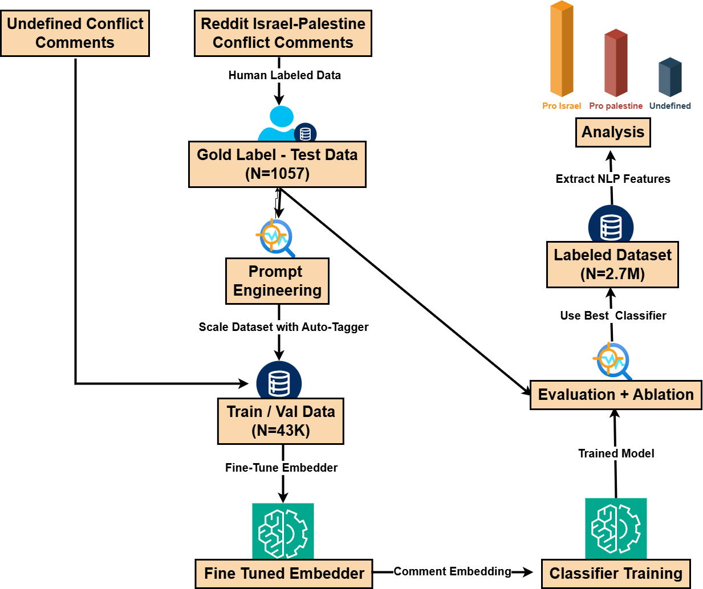

# Israel-Palestine-Political-Affiliation-Text-Classification

## Overview
This project aims to develop a robust machine learning (ML) and deep learning (DL) framework for classifying social media comments related to the Israel-Palestine conflict into distinct political affiliations: Pro-Israel, Pro-Palestine and Undefined. A key component of this project is the **Automated Tagger**, which leverages a Large Language Model (LLM) to generate labeled datasets, addressing the challenge of untagged data in the original dataset.

Using the automated tagger as benchmark and combining advanced contextual embeddings with optimized ML classifiers, this project seeks to set a new benchmark in nuanced text classification tasks with a simple, cheap and scaleable process.



## Features
- **Automated Tagger**: A module to generate labeled datasets from untagged social media comments (`llm_tagger.py`) using a Large Language Model (LLM) by OpenAI.
- **Flexible Dataset Class**: Responsible for text preprocessing for both classification process, augmentation, adversation and for handeling the dataloading for textual data (for finetuning of embedder) and for classifier training (creating an embedded dataset). Can switch from TF-IDF based embedding to Distil-BERT based embedding. Will handle caching the processed data for future use without the need to re-process. Note that the augmentation method was not useful at it's current state to the model's performance, but the functionality is still available.
- **Classifier**: Responsible for the flexible initialization and training of a classifier head, designated to train on top of the vectorized dataset (`classifiers.py`).
- **Customizable Configurations**: Easily adjustable parameters for LLM settings, , dataset settings, best model's configurations, and testing modes. Each major component has it's own configurations file under `Config` folder.
Note the the current configurations are the ones for the best performing model based on our research.
- **Analysis**: Within this folder you can find the analysis and optimizations that took place in the process. This folder also offers different flows like a GPU-compatible flow to use trained embedder + classifier on large dataset (in my case, 2.7M records).

## Usage
1. Configure settings in the `Config` files, one for auto-tagger, one for dataset and one for the classifiers:
   - Define file paths.
   - Set parameters (eg. OpenAI engine), augmentation ratio, and test batch size.
2. Ensure `secret_keys.py` is in place (root repository) with your OpenAI API key.

### Running the Automated Tagger
The `llm_tagger.py` module provides functionality to generate labels for an untagged dataset using the OpenAI API. The idea and motivation behind this is to create a sufficient subset to train for a classification task without having to manually tag tens of thousands of textual comments. Run the pipeline through `main.py`:

- **Test Mode** (`TEST_MODE = True`):
  - Tests the tagging process on a small, random subset of manually tagged data (`TAGGED_DATA_PATH`) of `TEST_BATCH_SIZE` comments.
  - Outputs an Accuracy and F1 score and saves mismatched predictions for inspection in `OUTPUT_FILE_PATH`.
  - Ideal for prompt engineering and verifying the labeling quality.
- **Batch Mode** (`TEST_MODE = False`):
  - Processes the entire untagged dataset (`FULL_DATA_PATH`) using the OpenAI batch API.
  - Outputs a fully labeled dataset in `OUTPUT_FILE_PATH`.
  - Used to prepare training data for ML/DL models.
  - The function `AITagger.run_pipeline` also have an input `method` that can be 'regular' or 'batch'. This addition is meant to use regular API or batch API on choice, given that the batch is ~50% cheaper but can take 24h per batch.

The automated tagger reached F1 Score of **87.8%** on the manually tagged subset (~1K comments).

### Running the Dataset
The `dataset.py` module is pretty straight forward and can be run through its `__main__`. Adjust the path and choose the subset you wish to work with (pre-divided), set up the file paths for the research data and vectorization weights, set augmentation ratio, traget groups and the data shape of the dataloader, meaning - this module will create a textual dataloader on defualt, assuming you have yet trained a model, but on demand will create a vectorized dataset (with embeddings for comments), under the assumption you have already fine-tuned a model, and have it's weights available. The vectorized dataset, once created under certain configurations will be saved as a pickle file to act as cache. If you'll delete this file you'll have to re-calculate the dataset. Not recommended.
This module uses the `embedder.py` module for that, and will create a dataloder fit for the classification task. Before calling a classification task be sure to set in `dataset_config.py` the parameters to matches your intention.

The trained weights for both models can be loaded from [this link](https://drive.google.com/drive/folders/1gNbb4B03qY2LVFy61dkgW_Ryf18YuRSm?usp=sharing). The training dataset (TRAIN+VAL+TEST -> `full_research_data_tagged.csv`) including the manually tagged comments, the already classified dataset (full 2.5M predicted labels -> `classified_comment_stance.csv`) and the embedded dataset (`distilbert_FULL.pkl`) can all be loaded from [this link](https://drive.google.com/drive/folders/1ifrWGB3KTyUDqPfhWipsQDPTdR64CWcH). The Best DistilBERT model was trained using the configurations described in the `Analysis\fit_embeddings.ipynb` and reached val_f1=0.84 on the 7th epoch. Both TFIDF model and DistilBERT pretrain folders are there. Place under local 'Embedding' folder to match with the paths in `dataset_config.py`.

### Training a Classifier
The `classifiers.py` module controls the training pipeline. It assumes you are already capable of creating a vectorized dataloader and will use it, and the tested configurations for the best ML model to train a classifier for the task. The best configurations were tested seperatly using 'Optuna' (analysis available at `Analysis` folder). This module allows you to choose between different model configurations.

When activated directly, this module allows you to test different configurations manually and assess the models while training on `SUBSET=TRAIN` and testing on `SUBSET=TEST`.

The best classifier (SVM on distilbert comment embedding) reached a total F1 score of **79.35%** on the gold-standard test set (~1K manually tagged comments).

The different trained classifier heads on the `distilbert-embeddings` are available in [this link](https://drive.google.com/drive/folders/12WxHUBNJqfAuy4TwynGQ85TqkggfaD2Z)

### Installation
Set up the environment and install dependencies:

```bash
python -m venv venv
venv\Scripts\activate
pip install -r requirements.txt
```

## Final Draft of the Paper
In this link, you may find the final draft for this paper, hoping it will be published soon:  
[📄 View Final Draft](https://drive.google.com/file/d/1NNCZqMsk0gYNtxtj4JviBk_mlpi88th0/view?usp=sharing)

# Related Work: Israel-Palestine-War-Reddit-Analysis
For users interested in analyzing the dynamics of this social media discussion, I recommend my related project: [Israel-Palestine Text Analysis](https://github.com/shaharoded/Israel-Palestine-War-Reddit-Analysis). This project provides a visualization dashboard to explore and compare Pro-Israelis and Pro-Palestinians online behavior based on various NLP metrics, including sentiment distribution, toxicity, and topic-based analysis. Built using Streamlit and Plotly, it enables interactive, within- and between-group comparisons of speech styles and tendencies.

The predictions generated by the classification pipeline from this project are utilized in the analysis project to enhance its plots and offer updated insights into political discourse trends. Together, these projects form a robust framework for studying polarized conversations in conflict-driven contexts.
